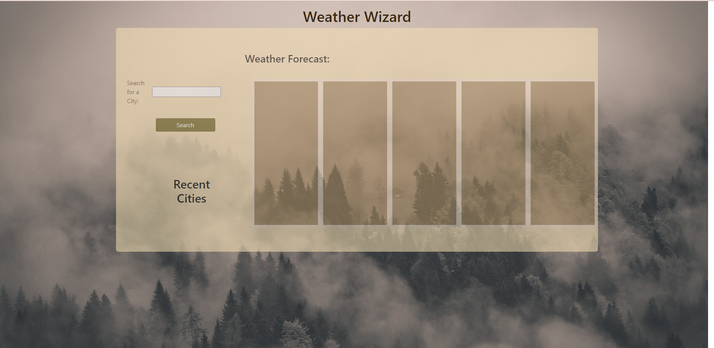
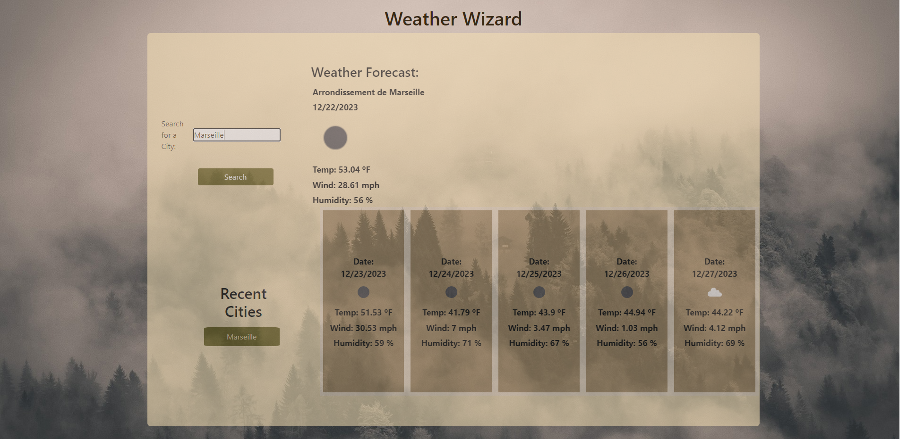
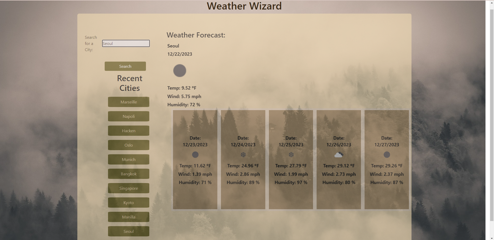

# Weather Wizard

## Description

Weather Wizard is an application for retrieving weather data for cities.  I built this project to practice and implement Third-Party APIs to access their data and functionality by making requests with specific parameters to a URL.  It solves the problem of wanting to see the weather outlook for multiple cities so that a user can plan a trip accordingly.  Throughout the Weather Wizard project, I learned that JSON format API responses give a plethora of measured or calculated data, a mix of both DOM and jQuery methods can be used to fetch and display icons, recently searched items can be displayed after clicking search without refreshing the page, and the openweathermap API calls more elements accross 5 days than needed because each index of elements is set at the 3 hour mark.  

## Installation

In order to fetch openweathermap API data, a specific API Key must be requested and stored within a JavaScript variable for easy reuse.  When constructing a query URL to make the API call, parameters give variable search terms that are added to an API call to specify requested data.  The API Key variable is concatenated at the end of the URL.  Calling the Fetch API passes the query URL in as a parameter and receives data.  Finally, the response data that's returned by the query can be used for storing and displaying to the webpage.

## Usage

To run Weather Wizard, load the page and type a city within the search box labeled "Search for a City."  Press "Enter" or click "Search" and the "Weather Forecast" will be displayed onscreen.  At the top and just below "Weather Forecast" is the current day weather.  Parameters included are the city name, date, an icon representation of the weather, temperature, wind speed, and humidity.  Just below the current day weather is the 5 day weather forecast for the searched city.  On the left side just below "Search" is the "Recent Cities" list.  Here, every searched city is saved to the local storage and displayed in a list after each click.  With a maximum of 10 Recent Cities displayed, each city has a button appended.  After clicking any "Recent City", the "Weather Forecast" will populate with that city's data.  Finally, the page can be refreshed and the recently searched cities will persist underneath "Recent Cities."  These instructions should help explain the dynamic features for a weather dashboard which retrieves current day and 5 day forecast data.

Attached is a screenshot before searching any cities:

Attached is a screenshot after searching a city:

Attached is a screenshot displaying the maximum number of recently searched cities:

## Deployed Site

[Deployed Site](https://tyler-kd.github.io/Weather-Wizard/)

## Credits

[How to Use API Keys](https://coding-boot-camp.github.io/full-stack/apis/how-to-use-api-keys)

[Current weather data](https://openweathermap.org/current#name)

[Weather Conditions](https://openweathermap.org/weather-conditions)

[5 day weather forecast](https://openweathermap.org/forecast5#name5)

[JavaScript Array Includes() Method](https://www.w3schools.com/jsref/jsref_includes_array.asp)

[Addition assignment (+=) - JavaScript](https://developer.mozilla.org/en-US/docs/Web/JavaScript/Reference/Operators/Addition_assignment)

[Moment.js](https://momentjs.com/)

## License

MIT License

Copyright (c) 2023 Tyler-KD

Permission is hereby granted, free of charge, to any person obtaining a copy of this software and associated documentation files (the "Software"), to deal in the Software without restriction, including without limitation the rights to use, copy, modify, merge, publish, distribute, sublicense, and/or sell copies of the Software, and to permit persons to whom the Software is furnished to do so, subject to the following conditions:

The above copyright notice and this permission notice shall be included in all copies or substantial portions of the Software.

THE SOFTWARE IS PROVIDED "AS IS", WITHOUT WARRANTY OF ANY KIND, EXPRESS OR IMPLIED, INCLUDING BUT NOT LIMITED TO THE WARRANTIES OF MERCHANTABILITY, FITNESS FOR A PARTICULAR PURPOSE AND NONINFRINGEMENT. IN NO EVENT SHALL THE AUTHORS OR COPYRIGHT HOLDERS BE LIABLE FOR ANY CLAIM, DAMAGES OR OTHER LIABILITY, WHETHER IN AN ACTION OF CONTRACT, TORT OR OTHERWISE, ARISING FROM, OUT OF OR IN CONNECTION WITH THE SOFTWARE OR THE USE OR OTHER DEALINGS IN THE SOFTWARE.

## Features

Included features: bootstrap, jQuery, openweathermap API, and Moment.js a Third-Party Library to parse, validate, manipulate, and display dates and times in JS.